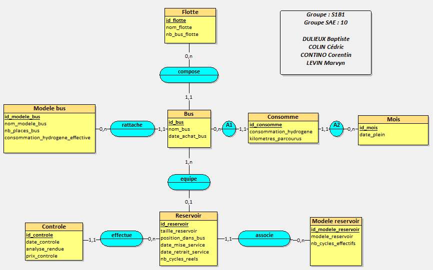
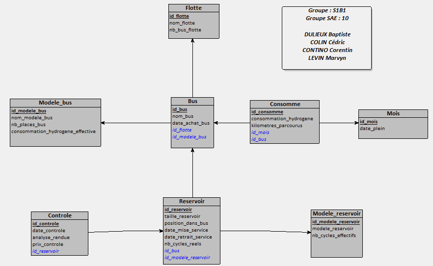
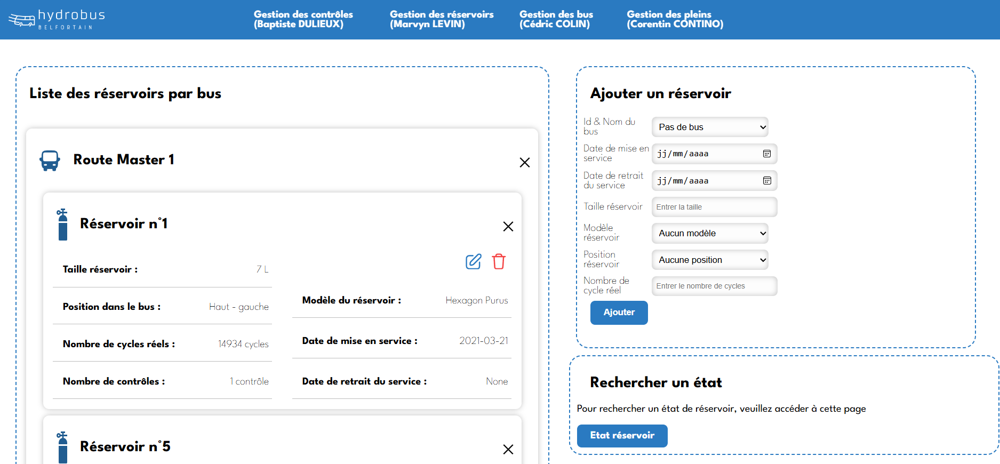

# Équipe Team Chartreuse - Projet BUT Informatique Hydrobus Belfortain - 09/10/2023 05/12/2023


## Informations Équipe
- **Membres** :
  - Baptiste DULIEUX
  - Marvyn LEVIN (référent)
  - Corentin CONTINO
  - Cédric COLIN
- **Objectif** : Développer un système de gestion de flotte pour les bus Hydrobus de Belfort, intégrant le suivi des véhicules et de leurs réservoirs d'hydrogène afin d'optimiser la gestion et l'efficacité opérationnelle.

---

## Documents liés au projet
- [Analyse des besoins-pdf](./docs/S1B1G10_LEVIN_Marvyn_COLIN_Cédric_DULIEUX_Baptiste_CONTINO_Corentin_analyse.pdf)
- [MCD & MLD-pdf](./docs/S1B1G10_LEVIN_Marvyn_COLIN_Cédric_DULIEUX_Baptiste_CONTINO_Corentin_modeleConceptionRelationnel.pdf)
- [Etude choix poste-pdf](./docs/S1B1G10_LEVIN_Marvyn_COLIN_Cédric_DULIEUX_Baptiste_CONTINO_Corentin_etude.pdf)
- [Notice installation poste-pdf](./docs/S1B1G10_LEVIN_Marvyn_COLIN_Cédric_DULIEUX_Baptiste_CONTINO_Corentin_architecture.pdf)

---

## Cahier des Charges

### 1. Présentation du Projet
- **But** : Concevoir un système d'information permettant la gestion efficace de la flotte de bus à hydrogène de la ville de Belfort, avec un suivi détaillé des véhicules et de leurs composants critiques, notamment les réservoirs d’hydrogène.
- **Moyens** : Élaboration d'un Modèle Conceptuel de Données (MCD) pour structurer les informations liées à la flotte, création d'une interface API pour l'accès aux données, et gestion des informations à travers une base de données relationnelle.
- **Objectifs du système** :
  - **Gestion de flotte** : Identification et suivi des bus, leurs modèles, leur consommation en hydrogène, et les informations d'entretien.
  - **Suivi des réservoirs d'hydrogène** : Surveillance de l’état et du positionnement des réservoirs sur chaque bus, enregistrement des contrôles de maintenance, et suivi de la durée de vie des réservoirs.
  - **Performances et consommation** : Collecte de données pour optimiser les itinéraires et réduire la consommation en hydrogène des bus.

### 2. Types de Fichiers
- **Modèle Conceptuel de Données (MCD)** : Réalisé avec un outil graphique dédié [looping](https://www.looping-mcd.fr/) et disponible au format `.loo`.

### 3. Recherche Documentaire
- **Ressources** :
  - [Documentation SQL et bases de données relationnelles](https://mariadb.org/documentation/)
  - [Références sur la conception de MCD et le modèle entité-association](https://developer.mozilla.org/fr/)
  - [Informations flotte actuelle à Belfort](https://www.optymo.fr/bus/bus-a-hydrogene/)

### 4. Répartition du Travail
- **Baptiste DULIEUX** :
  - Analyse des besoins, conception du MCD, gestion des contrôles
- **Marvyn LEVIN** :
  - Analyse des besoins, conception du MCD, gestion des réservoirs
- **Corentin CONTINO** :
  - Analyse des besoins, conception du MCD, gestion des pleins
- **Cédric COLIN** :
  - Analyse des besoins, conception du MCD, gestion des bus

---

## Concept de Modélisation

### Structure et Associations
- **Modèle Conceptuel de Données (MCD)** : Le MCD structuré pour gérer la flotte comprend plusieurs entités et leurs associations :
  - **Entités principales** :
    - *Flotte* : regroupe les bus par ensemble et permet le suivi du nombre de véhicules.
    - *Bus* : identifie chaque bus par son modèle, date d'achat, et autres informations.
    - *Mois* : période de suivi de la consommation de chaque bus.
    - *Modèle de Bus* : caractéristiques telles que le nombre de places et la consommation type du modèle.
    - *Réservoir* : gestion des informations de chaque réservoir (taille, position dans le bus, cycles de recharge).
    - *Contrôle* : suivi de chaque inspection des réservoirs pour garantir la sécurité.
  - **Associations** :
    - `compose` : associe un bus à une flotte.
    - `rattache` : associe chaque bus à un modèle.
    - `équipe` : relie un bus et ses réservoirs.
    - `effectue` : enregistre chaque contrôle de sécurité pour un réservoir.
    - `associe` : associe un réservoir à son modèle.
    - `consomme` : suit la consommation de chaque bus par mois.



- **Modèle Logique de Données (MLD)** : Le MLD traduit les entités et associations du MCD en tables pour une base de données relationnelle :

- **Tables principales** :
  - **Flotte** :
    - `id_flotte` (PK), `nom`, `nombre_vehicules`.
  - **Bus** :
    - `id_bus` (PK), `id_flotte` (FK), `id_modele_bus` (FK), `date_achat`, `statut_entretien`.
  - **Modèle de Bus** :
    - `id_modele_bus` (PK), `nombre_places`, `consommation_type`.
  - **Réservoir** :
    - `id_reservoir` (PK), `id_bus` (FK), `taille`, `position`, `cycle_recharge`.
  - **Contrôle** :
    - `id_controle` (PK), `id_reservoir` (FK), `date_controle`, `statut_securite`.
  - **Consommation** :
    - `id_bus` (FK, composite PK), `mois` (PK), `consommation_hydrogene`.

- **Intégrité Référentielle** : Clés primaires et étrangères assurent la cohérence des relations entre les tables.



### Inspiration et Conception Visuelle
- **Organisation de l'interface API et base de données** : Inspirée par des solutions de gestion de flotte modernes, ce projet adopte une architecture efficace pour l'interrogation des données en temps réel.



---

## Instructions d'Exécution sur Windows

### Étapes d'Installation

1. **Installation de MariaDB :**  
   Téléchargez et installez MariaDB depuis le site officiel : [MariaDB Download](https://mariadb.org/download/).
2. **Installation de Python :**
   Téléchargez et installez Python 3.13.3 depuis le site officiel : [Python Download](https://www.python.org/ftp/python/3.13.0/python-3.13.0-amd64.exe)

### Configuration de la Base de Données

Ouvrez une nouvelle fenêtre MariaDB 11.5 (x64) et exécutez les commandes suivantes :
```shell
# Se connecter avec l'utilisateur root
mysql -u root -p

# Créer un utilisateur
CREATE USER 'identifiant'@'localhost' IDENTIFIED BY 'votre_mot_de_passe';
GRANT ALL PRIVILEGES ON *.* TO 'identifiant'@'localhost' WITH GRANT OPTION;
FLUSH PRIVILEGES;

# Créer la base de données
CREATE DATABASE hydrobus;
USE hydrobus;
SHOW DATABASES;
```

### Exécution des Scripts SQL

- Exécutez les scripts SQL fournis dans le fichier `sql_projet.sql` pour créer les tables et charger les données initiales.

### Lancement de l'API

Ouvrez une nouvelle fenêtre PowerShell et exécutez les commandes suivantes :
```shell
cd \Desktop\hydrobusbelfortain

# Vérifier si python est existant
python --version

# Installer pip
pip install --upgrade pip 

# Installer Flask et PyMySQL
pip install flask
pip install pymysql

# Créer un environnement virtuel (venv)
python -m venv venv

# Activer l'environnement virtuel
.\venv\Scripts\Activate

# Installer Flask et PyMySQL dans l'environnement virtuel
pip install flask
pip install pymysql

# Créer le fichier de configuration de la base de données
Set-Content -Path "db.py" -Value @"
HOST = "localhost"
USER = "identifiant"
PASSWORD = "votre_mot_de_passe"
DATABASE = "hydrobus"
PORT = 3306
"@

# Vérifier le contenu du fichier db.py
Get-Content -Path "db.py"

# Lancer l'application Flask
python app.py
```

### API Lancée
Lorsque l’API Flask est lancée, vous devriez voir le message suivant :

```shell
 * Serving Flask app 'app'
 * Debug mode: off
WARNING: This is a development server. Do not use it in a production deployment. Use a production WSGI server instead.
 * Running on http://127.0.0.1:5000
Press CTRL+C to quit
```
